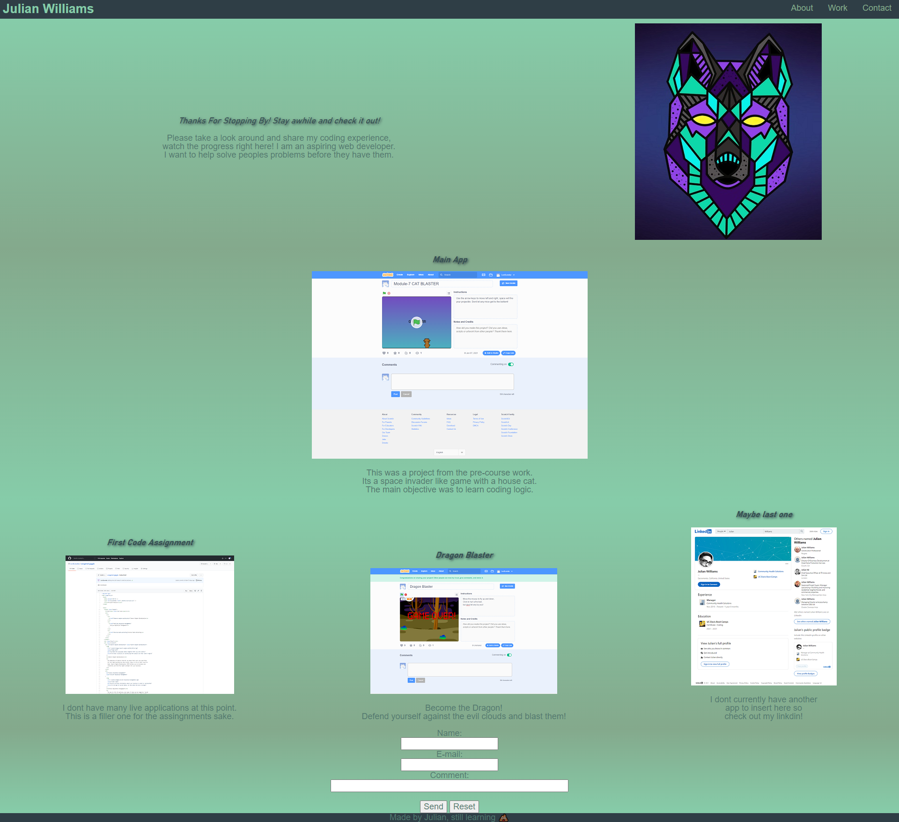

# Julian Williams' Portfolio

## Description

This project was designed to sharpen base skills. It will also serve as a constantly updated project.
It will have additional projects added and styles continued on and built upon. This is meant to display
my skills to future employers. It has helped me learn to keep responsive design forward in my design, and
the use of flex boxes. Outside of a coding mindset it also helped with wireframing and being able to
conceptualize a layout. As I become more adpet in coding the complexity of this page will also change.

```md

```

## Credits

A lof credit would be due to our TA Ryan Skog. He has been instrumental to me refining my skills.

## License

NOT SURE WHAT KIND TO USE
